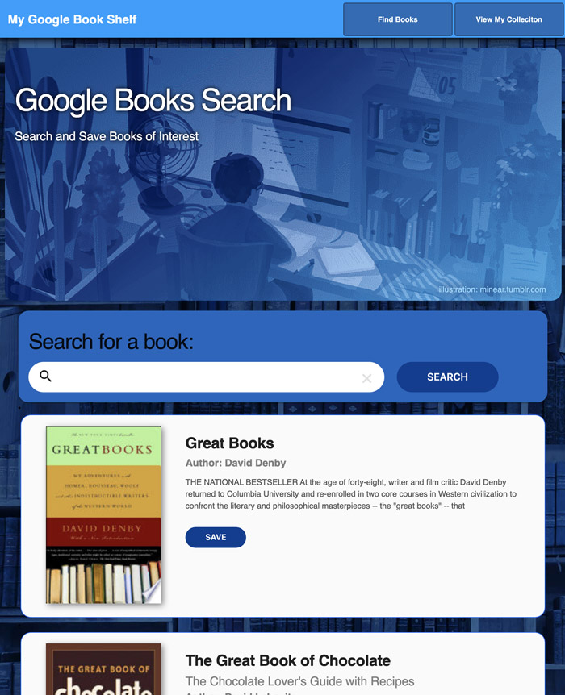

# myGoogleBooks
Full Stack MERN application to search for books from the Google Book API, and store them in a Mongo data base.


# Table of contents
1. [Installation](#Installation)
2. [Usage](#Usage)
3. [Live Demo](#Live_Demo)
4. [License](#License)
5. [Features](#Features)
6. [Technology](#Technology)
7. [Credits](#Credits)
8. [Badges](#Badges)
9. [User Story](#User_Story)
<a name="Installation"></a>
## Installation
```sh
npm install
```
<a name="Usage"></a>
## Usage
```sh
npm start
```
<a name="Live_Demo"></a>
## Live Demo
<a href="https://serene-sands-53576.herokuapp.com/">Live Demo on Heroku</a>
<a name='License'></a>
## License
[](https://lbesson.mit-license.org/)
<a name="Features"></a>
## Features
1. search for books
2. save books
3. delete books
<a name="Technology"></a>
## Technology
1. Express
2.  NodeJS
3.  GoogleBooksAPI
<a name="Credits"></a>
## Credits
Bart Dority, Daniel Jauregui, Shambhawi Kumari , 
<a name="Badges"></a>
## Badges
 [](https://shields.io/)

**on github:** <a href='github.com/b0rgBart3, Kionling'>b0rgBart3, Kionling</a>

[](https://github.com/remarkablemark)

Email: borgBart3@gmail.com
<a name="User_Story"></a>
## User Story
```sh
As an avid reader, I want to be able to store my own list of books that are available on Google Books, and then be able to easily access them at a later date.
```
